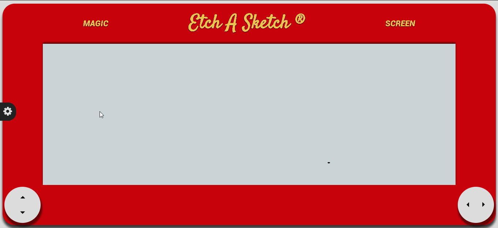

# Etch A Sketch

    

### Introdução

Etch A Sketch ou Traço Mágico (como é conhecido no Brasil) é um brinquedo de desenho mecânico inventado pelo francês André Cassagnes e subsequentemente fabricado pela empresa americana Ohio Art Company. O brinquedo é composto por uma tela plana cinza numa moldura plástica vermelha, com dois botões giratórios nos cantos inferiores da moldura. Ao se girarem os botões uma stylus espalha pó de alumínio no fundo da tela, deixando uma linha sólida. Os botões criam imagens lineográficas: o esquerdo move a stylus horizontalmente, e o direito a move na vertical.

O Etch A Sketch foi lançado em 1960, e é um dos brinquedos mais conhecidos daquela época. Em 1998, foi indicado ao National Toy Hall of Fame em Rochester, New York. Em 2003, a Toy Industry Association nomeou o Etch A Sketch como um dos 100 brinquedos mais memoráveis e mais criativos do século 20.

### História

O Etch A Sketch foi lançado em 1960, mas foi inventado no fim da década de 1950 por André Cassagnes. Em 1959, ele levou seu invento à Feira Internacional de Brinquedos em Nuremberg, Alemanha. A Ohio Art Company examinou mas não mostrou interesse no brinquedo. Quando a empresa viu o brinquedo pela segunda vez, decidiu dar uma chance a ele. A tela, chamada L'Ecran Magique foi logo rebatizada como "Etch A Sketch" e se tornou o brinquedo de desenho mais popular do mercado. Depois de uma série de negociações, a Ohio Art Company lançou o brinquedo nos Estados Unidos a tempo da temporada de Natal de 1960 com o nome "Etch A Sketch",com direito a uma campanha publicitária na televisão.  O Etch a Sketch foi fabricado em Bryan, Ohio até a empresa mudar sua fábrica para Shenzhen, China em 2001.